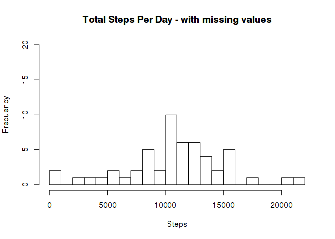
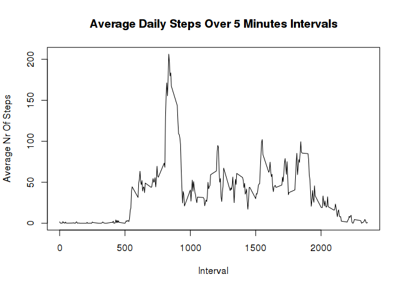
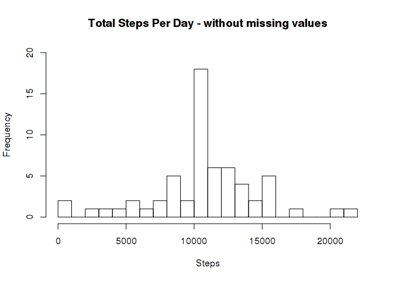
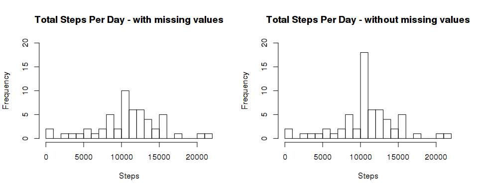
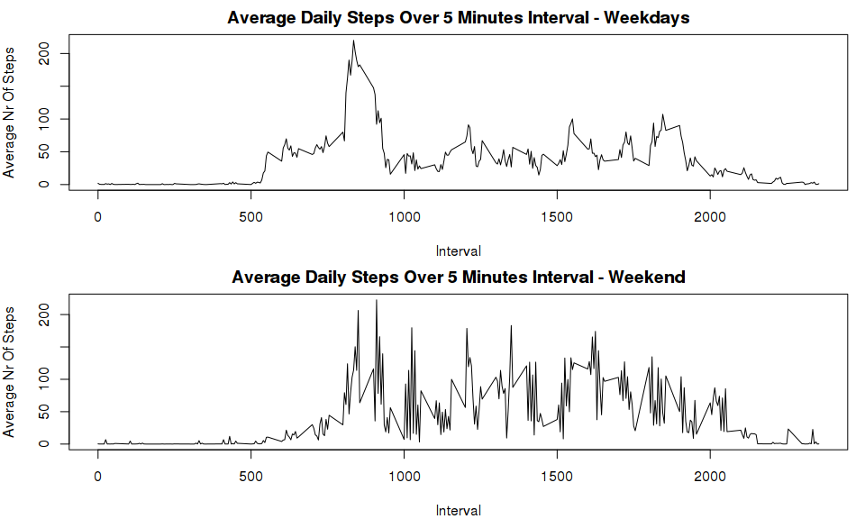

# Reproducible Research: Peer Assessment 1


```r
knitr::opts_chunk$set(echo = TRUE, results = "asis", fig.path='figure/')
options(scipen=100, digits=2)
require(xtable)
```

```
## Loading required package: xtable
```

## Loading and preprocessing the data

```r
file.url = "https://d396qusza40orc.cloudfront.net/repdata%2Fdata%2Factivity.zip"
if(!file.exists("./activity.csv")) {
    if(!file.exists("./activity.zip")) {
        download.file(file.url, "activity.zip", method="curl")
    }
    unzip("./activity.zip")
}
```

### 1. Load the data

```r
activityNAs <- read.csv("activity.csv")
```

### 2. Process/transform the data (if necessary) into a format suitable for your analysis

```r
activityNAs$date <- as.Date(activityNAs$date)
```


## What is the mean total number of steps taken per day?

### 1. Make a histogram of the total number of steps taken each day  


```r
stepsPerDayNAs <- aggregate(list(steps=activityNAs$steps), 
                            list(date=activityNAs$date), 
                            sum)
```


```r
hist(stepsPerDayNAs$steps, 
     breaks=22, 
     ylim=c(0,20), 
     main="Total Steps Per Day - with missing values", 
     xlab="Steps")
```

 

### 2. Calculate and report the mean and median total number of steps taken per day  


```r
meanStepsNAs <- mean(stepsPerDayNAs$steps, na.rm=T)
medianStepsNAs <- median(stepsPerDayNAs$steps, na.rm=T)
```
The mean number of steps without replacing missing values is  10766.19.  
The median number of steps without replacing missing values is 10765.


## What is the average daily activity pattern?

### 1. Make a time series plot (i.e. type = "l") of the 5-minute interval (x-axis) and the average number of steps taken, averaged across all days (y-axis)  


```r
averagePatternNAs <- aggregate(list(steps=activityNAs$steps),
                         list(interval=activityNAs$interval),
                         mean, 
                         na.rm=T)
```


```r
plot(averagePatternNAs, 
     type='l',
     main="Average Daily Steps Over 5 Minutes Intervals", 
     xlab="Interval",
     ylab="Average Nr Of Steps")
```

 

### 2. Which 5-minute interval, on average across all the days in the dataset, contains the maximum number of steps?  


```r
maxStepsNAs <- 
    averagePatternNAs[which(averagePatternNAs$steps==max(averagePatternNAs$steps)),]
```
The 5-minute interval containing the maximum average number of steps across all 
days is interval 835 with 206.17 steps.  


## Imputing missing values

### 1. Calculate and report the total number of missing values in the dataset (i.e. the total number of rows with NA s)

```r
nrNAs <- nrow(activityNAs[is.na(activityNAs$steps),])
```
The total number of missing values in the dataset is 2304.

### 2. Devise a strategy for filling in all of the missing values in the dataset The strategy does not need to be sophisticated. For example, you could use the mean/median for that day, or the mean for that 5-minute interval, etc.  

Strategy: Fill missing values with the mean value found for that 5-minute interval. The average number of steps for each 5-minute interval is stored in the averagePatternNAs data frame.

### 3. Create a new dataset that is equal to the original dataset but with the missing data filled in.  


```r
activityNoNAs <- activityNAs
# Fill missing values with the corresponing mean for that 5-minute interval 
# stored in averagePatternNAs
activityNoNAs[is.na(activityNoNAs$steps), "steps"] <-
    averagePatternNAs[match(activityNoNAs[is.na(activityNoNAs$steps), 
                                          "interval", ],
                         averagePatternNAs[,"interval"]), "steps"]
```

### 4. Make a histogram of the total number of steps taken each day and Calculate and report the mean and median total number of steps taken per day. Do these values differ from the estimates from the first part of the assignment? What is the impact of imputing missing data on the estimates of the total daily number of steps?  


```r
stepsPerDayNoNAs <- aggregate(list(steps=activityNoNAs$steps),
                              list(date=activityNoNAs$date), 
                              sum)
```


```r
hist(stepsPerDayNoNAs$steps, 
     breaks=22, 
     ylim=c(0,20), 
     main="Total Steps Per Day - without missing values", 
     xlab="Steps")
```

 


```r
meanStepsNoNAs <- mean(stepsPerDayNoNAs$steps, na.rm=T)
medianStepsNoNAs <- median(stepsPerDayNoNAs$steps, na.rm=T)
```

The mean number of steps with missing values replaced by the mean for the 
corresponding 5-minute interval is  10766.19.
The median is 10766.19.

Comparing the the mean and median values with missing values and the previously obtained without missing values we can see that the mean without missing values is 1.19 steps lower and median values do not differ.


```r
meanMedianSteps <- matrix(c(meanStepsNAs, 
                            medianStepsNAs, 
                            meanStepsNoNAs, 
                            medianStepsNoNAs), 
                          ncol=2)
colnames(meanMedianSteps) <- c("Mean", "Median")
rownames(meanMedianSteps) <- c("With Missing Values", "Without Missing Values")
meanMedianSteps <- xtable(as.table(meanMedianSteps))
print(meanMedianSteps, type="html")
```

<!-- html table generated in R 3.2.1 by xtable 1.7-4 package -->
<!-- Thu Jul 16 16:59:41 2015 -->
<table border=1>
<tr> <th>  </th> <th> Mean </th> <th> Median </th>  </tr>
  <tr> <td align="right"> With Missing Values </td> <td align="right"> 10766.19 </td> <td align="right"> 10766.19 </td> </tr>
  <tr> <td align="right"> Without Missing Values </td> <td align="right"> 10765.00 </td> <td align="right"> 10766.19 </td> </tr>
   </table>
  
  
Comparing the previously obtained histogram for the total daily number of steps with missing values with the histogram of the total daily number of steps without missing values we can see that the difference is a significant increase in the frequency of values between 10000 and 11000 steps. 


```r
par(mfrow=c(1,2))
hist(stepsPerDayNAs$steps, 
     breaks=22, 
     ylim=c(0,20), 
     main="Total Steps Per Day - with missing values", 
     xlab="Steps")
hist(stepsPerDayNoNAs$steps, 
     breaks=22, 
     ylim=c(0,20), 
     main="Total Steps Per Day - without missing values", 
     xlab="Steps")
```

 


## Are there differences in activity patterns between weekdays and weekends?

### 1. Create a new factor variable in the dataset with two levels – “weekday” and “weekend” indicating whether a given date is a weekday or weekend day.  


```r
activityNoNAs$dayType <- "0"
activityNoNAs$dayType <-  
    ifelse(weekdays(activityNoNAs$date)==c("Saturday", "Sunday"), 
           "weekend", 
           "weekday")
activityNoNAs$dayType <- as.factor(activityNoNAs$dayType)
```

### 2. Make a panel plot containing a time series plot (i.e. type = "l") of the 5-minute interval (x-axis) and the average number of steps taken, averaged across all weekday days or weekend days (y-axis). 


```r
weekdaysData <- activityNoNAs[which(activityNoNAs$dayType=="weekday"), ]
weekendData <- activityNoNAs[which(activityNoNAs$dayType=="weekend"), ]

averagePatternWeekdays <- aggregate(list(steps=weekdaysData$steps), 
                                    list(interval=weekdaysData$interval), 
                                    mean, na.rm=T)

averagePatternWeekends <- aggregate(list(steps=weekendData$steps),
                                    list(interval=weekendData$interval),
                                    mean, na.rm=T)
```


```r
par(mfrow=c(2,1),mar=c(4,4,2,1))
plot(averagePatternWeekdays, type='l', 
     main="Average Daily Steps Over 5 Minutes Interval - Weekdays", 
     xlab="Interval",
     ylab="Average Nr Of Steps")
plot(averagePatternWeekends, type='l', 
     main="Average Daily Steps Over 5 Minutes Interval - Weekend", 
     xlab="Interval",
     ylab="Average Nr Of Steps")
```

 


